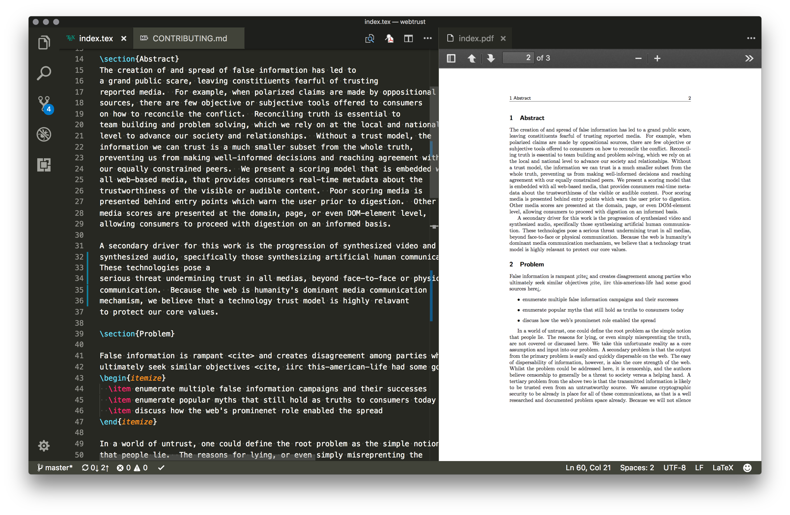

# contributing

## prereqs

- install [latex](https://www.latex-project.org/about/)
- install [nodejs](https://nodejs.org/en/)

## setup

- clone
- `cd webtrust`
- `npm install`

## edit

- branch to your feature branch
- use the preferred `latex` editor of your choice
  - i use VSCode with the [latex-workshop](https://marketplace.visualstudio.com/items?itemName=James-Yu.latex-workshop) plugin

- push
- send a PR!
